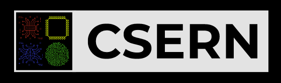

# Proyecto 1 - DBP - CSERN

##  Nombre del Proyecto

- Todos Manager - Susy

## Integrantes
- Alvarado Salazar, Grace Nikole
- Rodríguez Llanos, Renato Sebastián
- Rosario Palomino, Diego Antonio
- Rubio Montiel, Ignacio

## Descripción del Proyecto
- Todos Manager - Susy, tiene como objetivo principal ser una 
  herramienta de apoyo amigable para ayudar a organizar tareas.
  Inspirado en Google Tasks, esta herramienta fue creada para,
  obtener un producto similar sin dependencias de Google.

- Misión: Facilitar el manejo de responsabilidades de los usuarios.

- Visión: La visión de nuestra empresa es generar un mundo en donde todas las personas no tengan que sufrir por olvidarse de sus quehaceres del día a día.

## Tecnologías utilizadas

### Base de Datos
- Postgresql

### Backend
- Python 3 
- Flask 
- SQLAlchemy

### Fronted
- UIkit
- Javasript
- CSS

## Script para cargar datos a la Base de Datos
- Ejecutar `init_data.py`

## Referencias de API
- `/auth/signup` METHOD: POST
- `/auth/login` METHOD: POST
- `/<user_name>/<table_name>/todos/displayall/`
- `/<user_name>/<table_name>/todos/displaycompleted`
- `/<user_name>/<table_name>/todos/displayincompleted`
- `/<user_name>/<table_name>/<table_id>/todos/`
- `/<user_name>/<table_name>/todos/add/` METHOD: POST
- `/<user_name>/<table_name>/todos/update/` METHOD: POST
- `/<user_name>/<table_name>/todos/editdeadline/` METHOD: POST
- `/<user_name>/<table_name>/todos/update_is_done/` METHOD: POST
- `/<user_name>/<table_name>/todos/delete/` METHOD: POST
- `/<user_name>/<table_name>/tablero/delete/ ` METHOD: POST
- `/<user_name>/<table_name>/tablero/share/ ` METHOD: POST

## Hosts
- La aplicación corre en el localhost `127.0.0.1`, en el puerto `5001`.

## Forma de Autenticación
- No tenemos forma de autenticación.

## Manejo de Errores
- Manejamos dos errores:
    - 404: Nos redirecciona a la página `page_not_found.html`.
    - 505: Nos redirecciona a la página `page_not_found.html`.

## Información acerca de los requests y response de cada endpoint
- `/auth/signup` METHOD: POST
    - Este método se ejecuta cuando un usuario se crea.
    - Debe enviar un JSON ```{
      'username': username,
      'email': email,
      'status': 'true',
      'table': table.name
    } ```.
    - Retorna el username y el email del usuario creado.```{
        'username': username,
        'email': email,
    } ```.
    - En caso de que falle se generará un error 500.
- `/auth/login` METHOD: POST
    - Este método nos permite ingresar a nuestro Dashboard.
    - Debe enviar un JSON ```{
      'response': 'true',
      'user': usxr.username,
      'tablero_name': 'default',
      'table_id': tablero_id
    } ```.
    - Retorna un JSON `{ response: true }`, en caso de que hayas ingresado satisfactoriamente.
    - Retorna un JSON `{ response: false }`, en caso de que no hayas ingresado bien un campo.
- `/<user_name>/todos/displayall/`
    - Recibe el nombre del usuario.
    - Este método retorna un JSON con todos los Todos.
- `<user_name>/todos/displaycompleted`
    - Recibe el nombre del usuario.
    - Este método retorna un JSON con todos los Todos que ya han sido completados.
- `<user_name>/todos/displayincompleted`
    - Este método retorna un JSON con todo los Todos que ya han sido completados.
- `/<user_name>/<table_name>/<table_id>/todos/`
    - Recibe el nombre de usuario.
    - Recibe el nombre de la tablero y el id de la tablero.
    - Redirecciona a la página de los Todos de un usuario.
- `/<user_name>/<table_name>/todos/add/` METHOD: POST
    - Este método nos permite añadir Todos.
    - Recibe el nombre de usuario por la URL y el Todo como un JSON `{ description: value }`.
    - Recibe el nombre de la tablero y el id de la tablero.
    - Retorna un JSON `{ status: true }`, en caso de que la tarea ha sido creada satisfactoriamente.
    - Retorna un JSON `{ status: false }`, en caso de que la tarea no haya sido creada.
- `/<user_name>/<table_name>/todos/update/` METHOD: POST
    - Este método nos permite actualizar un Todo.
    - Recibe el username por la URL y el nombre de la tablero.
    - Retorna un JSON `{ status: true }`, en caso de que la tarea ha sido actualizada satisfactoriamente.
    - Retorna un JSON `{ status: false }`, en caso de que la tarea no se haya podido actualizar.
- `/<user_name>/<table_name>/todos/editdeadline/` METHOD: POST
    - Este método nos permite actualizar el deadline de un Todo.
    - Recibe el username por la URL y el nombre de la tablero.
    - Retorna un JSON `{ status: true }`, en caso de que el deadline de la tarea ha sido actualizada satisfactoriamente.
    - Retorna un JSON `{ status: false }`, en caso de que el deadline de la tarea no se haya podido actualizar.
- `/<user_name>/<table_name>/todos/update_is_done/` METHOD: POST
    - Este método permite actualizar una tarea de incompleta a completa.
    - Recibe el username por la URL y el nombre de la tablero.
    - Retorna un JSON `{ status: true }`, en caso de que la tarea ha sido actualizado satisfactoriamente.
    - Retorna un JSON `{ status: false }`, en caso de que la tarea no ha sido actualizado.
- `/<user_name>/<table_name>/todos/delete/`
    - Este método permite eliminar un Todo.
    - Recibe el username por la URL y el nombre de la tablero.
    - Retorna un JSON `{ status: true }`, en caso de que la tarea ha sido eliminado satisfactoriamente.
    - Retorna un JSON `{ status: false }`, en caso de que la tarea no ha sido eliminado.
- `/table/create` METHOD: POST
    - Este método nos permite crear un nuevo Tablero.
    - Traerá desde los inputs de nuestro form el nombre del tablero, el dueño del tablero y un booleano para saber si es admin.
    - Debe retornar un JSON para saber si se creó correctamente ```{
      'name': table.name,
      'status': 'true'
    } ```.
- `/<user_name>/<table_name>/tablero/delete/` METHOD: POST
    - Este método nos permite eliminar un Tablero.
    - Recibe el dueño del tablero y el nombre del tablero.
    - Retorna un JSON `{ status: true }`, en caso de que  el tablero haya sido eliminado satisfactoriamente.
    - Retorna un JSON `{ status: false }`, en caso de que el tablero no haya sido eliminado.
- `/<user_name>/<table_name>/tablero/share/` METHOD: POST
    - Este método nos permite compartir un Tablero.
    - Recibe el dueño del tablero y el nombre del usuario a quién deseo compartir.
    - Retorna un JSON `{ status: true }`, en caso de que  el tablero haya sido eliminado satisfactoriamente.
    - Retorna un JSON `{ status: false }`, en caso de que el tablero no haya sido eliminado.
## Deployment scripts
- En primer lugar, debemos crear la base de datos de la aplicación. La base de datos debe ser PostgresSQL. 
``` 
CREATE DATABASE todosdb
```
- Luego debemos utilizar las migracione para crear todas las tablas de la base de datos.
```
$ flask db upgrade
```
- Y para ejecutar la aplicación:
```
$ python3 app.py
```
